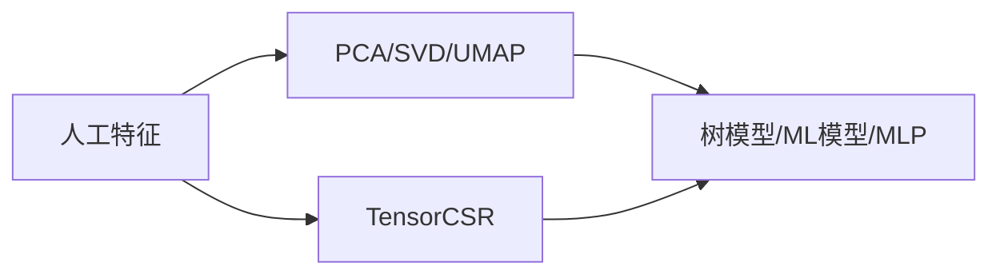

---
# try also 'default' to start simple
theme: seriph
# random image from a curated Unsplash collection by Anthony
# like them? see https://unsplash.com/collections/94734566/slidev
background: https://source.unsplash.com/collection/94734566/1920x1080
# apply any windi css classes to the current slide
class: 'text-center'
# https://sli.dev/custom/highlighters.html
highlighter: shiki
# some information about the slides, markdown enabled
info: |
  ## Slidev Starter Template
  Presentation slides for developers.

  Learn more at [Sli.dev](https://sli.dev)
title: Kaggle-OpenProblem
date: 2022-09-06
sidebar: "auto"
categories:
- kaggle
tags:
- kaggle

---


# Kaggle-OpenProblem


<style>
  h2:before {
    border-left: 0px solid #3489fd;
}
  </style>
  
---

<div class="text-center p-5 text-3xl my-5" style="color: #ffffff;text-shadow: 0 0 10px #000000;background: #aaaaaa;">
目录
</div>
<toc columns="2"/>

---

<div class="text-center m-50 py-3" style="color: #ffffff;text-shadow: 0 0 10px #000000;background: #aaaaaa;">

## 数据集

</div>


---

**数据集解释**


- evaluation_ids.csv

- metadata.csv

- sample_submission.csv

- test_cite_inputs.h5
- test_multi_inputs.h5
- train_cite_inputs.h5
- train_cite_targets.h5
- train_multi_inputs.h5
- train_multi_targets.h5

---

本次比赛有两个任务，一个是citeseq，一个是multiome，可以看成两个比赛

cite和multi分别对应citeseq和multiome

>For the **Multiome** samples: given chromatin accessibility, predict gene expression. **DNA->RNA**

<br/>


>For the **CITEseq** samples: given gene expression, predict protein levels. **RNA->Protein**

0.743 for **CITE** and 0.257 for MULTI

<table style="transform: scale(0.8);transform-origin: 0 0;">
  <tr>
    <td></td>
    <td>
    row中的每一个(cell_id,gene_id)对是二维单元格的位置
    </td>
  </tr>
</table>


---


### evaluation_ids.csv


---

### metadata.csv

<!--  -->
描述了测量天数，捐赠者，细胞类型（不准确），测量技术


MasP = Mast Cell Progenitor

MkP = Megakaryocyte Progenitor

NeuP = Neutrophil Progenitor

MoP = Monocyte Progenitor

EryP = Erythrocyte Progenitor

HSC = Hematoploetic Stem Cell

BP = B-Cell Progenitor

---

### sample_submission.csv

和`evaluation_ids.csv`一一对应

<!--  -->

<!--  -->


| evaluation_id | sample_id |
| :---: | :---: |
|  |  |


---

### train_cite_inputs.h5


**Citeseq**中每个细胞有22050个特征，且大部分为0。表格没有缺失值。

---

### train_cite_targets.h5


<div class="text-xs">
70988 cell × 140 

140列为已被dsb归一化的相同细胞的表面蛋白水平。

target 是 140 ，可以用140个机器学习器(lgbm xgb)，也可以全部预测用cell做mse loss或pearson loss

</div>


Gene列的名称有蛋白质关系
<div class="text-xs">
Important_cols is the set of all features whose name matches the name of a target protein. If a gene is named 'ENSG00000114013_CD86', it should be related to a protein named 'CD86'. These features will be used for the model unchanged, that is, they don't undergo dimensionality reduction.
</div>


> 所有的140 column如下


<div class="overflow-auto h-100 text-xs">
CD86 CD274 CD270 CD155 CD112 CD47 CD48 CD40 CD154 CD52 CD3 CD8 CD56 CD19 CD33 CD11c HLA-A-B-C CD45RA CD123 CD7 CD105 CD49f CD194 CD4 CD44 CD14 CD16 CD25 CD45RO CD279 TIGIT Mouse-IgG1 Mouse-IgG2a Mouse-IgG2b Rat-IgG2b CD20 CD335 CD31 Podoplanin CD146 IgM CD5 CD195 CD32 CD196 CD185 CD103 CD69 CD62L CD161 CD152 CD223 KLRG1 CD27 CD107a CD95 CD134 HLA-DR CD1c CD11b CD64 CD141 CD1d CD314 CD35 CD57 CD272 CD278 CD58 CD39 CX3CR1 CD24 CD21 CD11a CD79b CD244 CD169 integrinB7 CD268 CD42b CD54 CD62P CD119 TCR Rat-IgG1 Rat-IgG2a CD192 CD122 FceRIa CD41 CD137 CD163 CD83 CD124 CD13 CD2 CD226 CD29 CD303 CD49b CD81 IgD CD18 CD28 CD38 CD127 CD45 CD22 CD71 CD26 CD115 CD63 CD304 CD36 CD172a CD72 CD158 CD93 CD49a CD49d CD73 CD9 TCRVa7.2 TCRVd2 LOX-1 CD158b CD158e1 CD142 CD319 CD352 CD94 CD162 CD85j CD23 CD328 HLA-E CD82 CD101 CD88 CD224
</div>

---

CD含义: Cluster of Differentiation 分化簇

[Cluster map绘制](https://www.kaggle.com/code/alexandervc/mmscel-eda-bioinfo?scriptVersionId=103869738&cellId=17)


---

### train_multi_inputs.h5


每个细胞有22万个特征

---

### train_multi_targets.h5


每个细胞23418个目标

---

### 测试集

两个测试集，除了没有标签之外其他和train相同

- test_cite_inputs.h5
- test_multi_inputs.h5


---

### 汇总

综上所述


- mutiome任务，输入维度22万，输出标签23418个

- citeseq任务，输入维度2万，输出标签140个

数据量巨大

**⭐在特征降维和数据加载上都具有挑战**

<table style="transform: scale(0.8);transform-origin: 0 0;">
  <tr>
    <td></td>
    <td>
    row中的每一个(cell_id,gene_id)对是二维单元格的位置
    </td>
  </tr>
</table>


---


<div class="text-center m-50 py-3" style="color: #ffffff;text-shadow: 0 0 10px #000000;background: #aaaaaa;">

## 模型&提交相关

</div>

---


<!-- ### 数据读取内存占用 -->


<!-- <table>
  <tr>
    <th>操作</th>
    <th>内存占用</th>
  </tr>
  <tr>
    <td>
    
    </td>
    <td>9G</td>
  </tr>
  <tr>
    <td>
    
    </td>
    <td>7G</td>
  </tr>
</table> -->


### CV划分

<br/>

```
kf.split(X, groups=meta.donor)
```


特征和天数也有关系，随着时间有固定方向的偏移


> 注意：ensemble要统一cv

---

### 模型训练-Pytorch

```
config = dict(
    layers = [128, 128, 128],
...
class MLP(nn.Module):
    def __init__(self, layer_size_lst, add_final_activation=False):
        super().__init__()
        
        assert len(layer_size_lst) > 2
        
        layer_lst = []
        for i in range(len(layer_size_lst)-1):
            sz1 = layer_size_lst[i]
            sz2 = layer_size_lst[i+1]
            layer_lst += [nn.Linear(sz1, sz2)]
            if i != len(layer_size_lst)-2 or add_final_activation:
                 layer_lst += [nn.ReLU()]
        self.mlp = nn.Sequential(*layer_lst)
```

在Kaggle 16G GPU，13G RAM中，可以传入进来一个22万维的tensor稀疏向量`torch.Size([512, 228942])`

> 缺点：
只能使用max归一化;减去平均值，会破坏这里的tensorCSR稀疏性。操作受限。

---

### 模型训练-降维

- 人工特征+PCA/SVD降维+树模型/MLP

<div class="mx-10 my-5">



</div>


- 其他降维方法

```
list_fast_methods = ['PCA','umap','FA', 'NMF','RandProj','RandTrees'] # 'ICA',
list_slow_methods = ['t-SNE','LLE','Modified LLE','Isomap','MDS','SE','LatDirAll','LTSA','Hessian LLE']
```


---

### Loss

<table class="my-10" style="table-layout:fixed">
  <tr>
    <th>Pearson</th>
    <th>MSE</th>
  </tr>
  <tr>
    <td><pre class="slidev-code " style="color: white; background-color: black;">
class NegativeCorrLoss(nn.Module):
    def __init__(self):
        super().__init__()
    def forward(self, preds, targets):
        my = torch.mean(preds, dim=1)
        my = torch.tile(torch.unsqueeze(my, dim=1), (1, targets.shape[1]))
        ym = preds - my
        r_num = torch.sum(torch.multiply(targets, ym), dim=1)
        r_den = torch.sqrt(
            torch.sum(torch.square(ym), dim=1) * float(targets.shape[-1])
        )
        r = torch.mean(r_num / r_den)
        return -r
</pre></td>
    <td>
    <pre  class="slidev-code" style="color: white; background-color: black;">def criterion(outputs, labels):
    """ MSE Loss function"""
    return nn.MSELoss()(outputs, labels)</pre>
    </td>
 </tr>
</table>


> 两个可以都尝试一下

---

### ensemble策略


- Statement 1. Correlation loss is <font class="text-red-600">insensitive to linear transformations</font> of predictions

- Statement 2. Per-cell_id standardization helps to rescale base submissions
Under assumption that two base submissions are similar and demonstrate similar performance we could rescale them in the way that they become comparable and weighting in a regular way becomes adequate:


- Statement 3. Weighting coefficients don't have to add up to 1!
This is one of the benefit of the loss function that is agnostic to linear transformations. You don't have to weight base submissions as usual with $\sum_i w_i=1$. Any coefficients will do the job!


---

作者做了一个实验


<br/>
<br/>
<br/>

|std前|std后|
|:--:|:--:|
0.92417836 | 0.94238122

---

### 比赛特点

本次比赛只需要提交submission.csv，也就是纯表格赛。人数会非常多。


训练时间无限，可无限融合

---

<div class="text-center m-50 py-3" style="color: #ffffff;text-shadow: 0 0 10px #000000;background: #aaaaaa;">


## EDA

</div>


