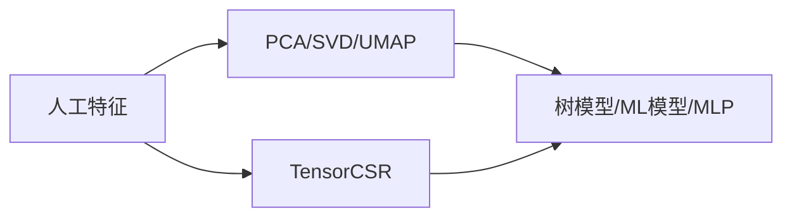
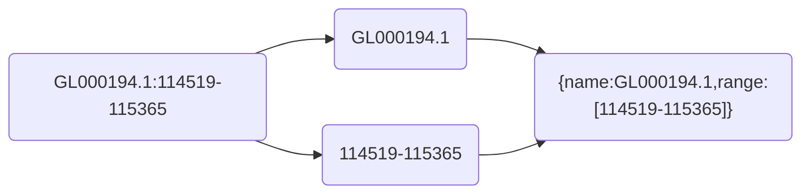
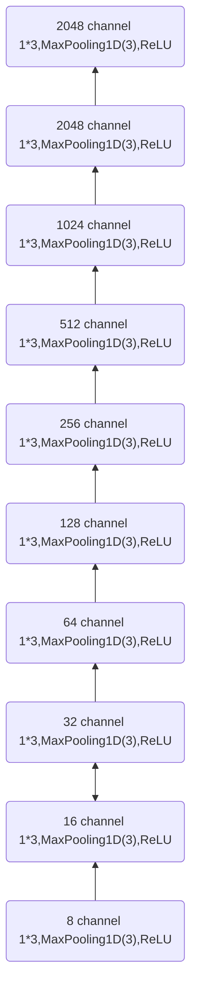
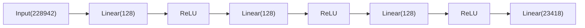

---
# try also 'default' to start simple
theme: seriph
# random image from a curated Unsplash collection by Anthony
# like them? see https://unsplash.com/collections/94734566/slidev
background: https://source.unsplash.com/collection/94734566/1920x1080
# apply any windi css classes to the current slide
class: 'text-center'
# https://sli.dev/custom/highlighters.html
highlighter: shiki
# some information about the slides, markdown enabled
info: |
  ## Slidev Starter Template
  Presentation slides for developers.

  Learn more at [Sli.dev](https://sli.dev)
title: Kaggle-OpenProblem
date: 2022-09-06
sidebar: "auto"
categories:
- kaggle
tags:
- kaggle

---


# Kaggle-OpenProblem


<style>
  h2:before {
    opacity: 0;
}
  </style>

---

<div class="text-center p-5 text-3xl my-5" style="color: #ffffff;text-shadow: 0 0 10px #000000;background: #aaaaaa;">
目录
</div>

<div class="overflow-auto h-90 mb-5">
<toc columns="2"/>
</div>

---

<div class="text-center m-50 py-3" style="color: #ffffff;text-shadow: 0 0 10px #000000;background: #aaaaaa;">

## 数据集

</div>


---

**数据集解释**


- evaluation_ids.csv

- metadata.csv

- sample_submission.csv

- test_cite_inputs.h5
- test_multi_inputs.h5
- train_cite_inputs.h5
- train_cite_targets.h5
- train_multi_inputs.h5
- train_multi_targets.h5

---

本次比赛有两个任务，一个是citeseq，一个是multiome，可以看成两个比赛

cite和multi分别对应citeseq和multiome

>For the **Multiome** samples: given chromatin accessibility, predict gene expression. **DNA->RNA**

<br/>


>For the **CITEseq** samples: given gene expression, predict protein levels. **RNA->Protein**

0.743 for **CITE** and 0.257 for MULTI

<table style="transform: scale(0.8);transform-origin: 0 0;">
  <tr>
    <td></td>
    <td>
    row中的每一个(cell_id,gene_id)对是二维单元格的位置
    </td>
  </tr>
</table>


---


### evaluation_ids.csv


---

### metadata.csv

<!--  -->
描述了测量天数，捐赠者，细胞类型（不准确），测量技术


MasP = Mast Cell Progenitor

MkP = Megakaryocyte Progenitor

NeuP = Neutrophil Progenitor

MoP = Monocyte Progenitor

EryP = Erythrocyte Progenitor

HSC = Hematoploetic Stem Cell

BP = B-Cell Progenitor

---

### sample_submission.csv

和`evaluation_ids.csv`一一对应

<!--  -->

<!--  -->


| evaluation_id | sample_id |
| :---: | :---: |
|  |  |


---

### train_cite_inputs.h5


**Citeseq**中每个细胞有22050个特征，且大部分为0。表格没有缺失值。

---

### train_cite_targets.h5


<div class="text-xs">
70988 cell × 140 

140列为已被dsb归一化的相同细胞的表面蛋白水平。

target 是 140 ，可以用140个机器学习器(lgbm xgb)，也可以全部预测用cell做mse loss或pearson loss

</div>


Gene列的名称有蛋白质关系
<div class="text-xs">
Important_cols is the set of all features whose name matches the name of a target protein. If a gene is named 'ENSG00000114013_CD86', it should be related to a protein named 'CD86'. These features will be used for the model unchanged, that is, they don't undergo dimensionality reduction.
</div>


> 所有的140 column如下


<div class="overflow-auto h-100 text-xs">
CD86 CD274 CD270 CD155 CD112 CD47 CD48 CD40 CD154 CD52 CD3 CD8 CD56 CD19 CD33 CD11c HLA-A-B-C CD45RA CD123 CD7 CD105 CD49f CD194 CD4 CD44 CD14 CD16 CD25 CD45RO CD279 TIGIT Mouse-IgG1 Mouse-IgG2a Mouse-IgG2b Rat-IgG2b CD20 CD335 CD31 Podoplanin CD146 IgM CD5 CD195 CD32 CD196 CD185 CD103 CD69 CD62L CD161 CD152 CD223 KLRG1 CD27 CD107a CD95 CD134 HLA-DR CD1c CD11b CD64 CD141 CD1d CD314 CD35 CD57 CD272 CD278 CD58 CD39 CX3CR1 CD24 CD21 CD11a CD79b CD244 CD169 integrinB7 CD268 CD42b CD54 CD62P CD119 TCR Rat-IgG1 Rat-IgG2a CD192 CD122 FceRIa CD41 CD137 CD163 CD83 CD124 CD13 CD2 CD226 CD29 CD303 CD49b CD81 IgD CD18 CD28 CD38 CD127 CD45 CD22 CD71 CD26 CD115 CD63 CD304 CD36 CD172a CD72 CD158 CD93 CD49a CD49d CD73 CD9 TCRVa7.2 TCRVd2 LOX-1 CD158b CD158e1 CD142 CD319 CD352 CD94 CD162 CD85j CD23 CD328 HLA-E CD82 CD101 CD88 CD224
</div>

---

CD含义: Cluster of Differentiation 分化簇

[Cluster map绘制](https://www.kaggle.com/code/alexandervc/mmscel-eda-bioinfo?scriptVersionId=103869738&cellId=17)


---

### train_multi_inputs.h5


每个细胞有22万个特征

---

### train_multi_targets.h5


每个细胞23418个目标

---

### 测试集

两个测试集，除了没有标签之外其他和train相同

- test_cite_inputs.h5
- test_multi_inputs.h5


---

### 汇总

综上所述


- mutiome任务，输入维度22万，输出标签23418个

- citeseq任务，输入维度2万，输出标签140个

数据量巨大

**⭐在特征降维和数据加载上都具有挑战**

<table style="transform: scale(0.8);transform-origin: 0 0;">
  <tr>
    <td></td>
    <td>
    row中的每一个(cell_id,gene_id)对是二维单元格的位置
    </td>
  </tr>
</table>


---


<div class="text-center m-50 py-3" style="color: #ffffff;text-shadow: 0 0 10px #000000;background: #aaaaaa;">

## 模型&提交相关

</div>

---


<!-- ### 数据读取内存占用 -->


<!-- <table>
  <tr>
    <th>操作</th>
    <th>内存占用</th>
  </tr>
  <tr>
    <td>
    
    </td>
    <td>9G</td>
  </tr>
  <tr>
    <td>
    
    </td>
    <td>7G</td>
  </tr>
</table> -->


### CV划分

<br/>

```
kf.split(X, groups=meta.donor)
```


特征和天数也有关系，随着时间有固定方向的偏移


> 注意：ensemble要统一cv

---

### 模型训练-Pytorch

```
config = dict(
    layers = [128, 128, 128],
...
class MLP(nn.Module):
    def __init__(self, layer_size_lst, add_final_activation=False):
        super().__init__()
        
        assert len(layer_size_lst) > 2
        
        layer_lst = []
        for i in range(len(layer_size_lst)-1):
            sz1 = layer_size_lst[i]
            sz2 = layer_size_lst[i+1]
            layer_lst += [nn.Linear(sz1, sz2)]
            if i != len(layer_size_lst)-2 or add_final_activation:
                 layer_lst += [nn.ReLU()]
        self.mlp = nn.Sequential(*layer_lst)
```

在Kaggle 16G GPU，13G RAM中，可以传入进来一个22万维的tensor稀疏向量`torch.Size([512, 228942])`

> 缺点：
只能使用max归一化;减去平均值，会破坏这里的tensorCSR稀疏性。操作受限。

---

### 模型训练-降维

- 人工特征+PCA/SVD降维+树模型/MLP

<div class="mx-10 my-5">



</div>


- 其他降维方法

```
list_fast_methods = ['PCA','umap','FA', 'NMF','RandProj','RandTrees'] # 'ICA',
list_slow_methods = ['t-SNE','LLE','Modified LLE','Isomap','MDS','SE','LatDirAll','LTSA','Hessian LLE']
```


---

### Loss

<table class="my-10" style="table-layout:fixed">
  <tr>
    <th>Pearson</th>
    <th>MSE</th>
  </tr>
  <tr>
    <td><pre class="slidev-code " style="color: white; background-color: black;">
class NegativeCorrLoss(nn.Module):
    def __init__(self):
        super().__init__()
    def forward(self, preds, targets):
        my = torch.mean(preds, dim=1)
        my = torch.tile(torch.unsqueeze(my, dim=1), (1, targets.shape[1]))
        ym = preds - my
        r_num = torch.sum(torch.multiply(targets, ym), dim=1)
        r_den = torch.sqrt(
            torch.sum(torch.square(ym), dim=1) * float(targets.shape[-1])
        )
        r = torch.mean(r_num / r_den)
        return -r
</pre></td>
    <td>
    <pre  class="slidev-code" style="color: white; background-color: black;">def criterion(outputs, labels):
    """ MSE Loss function"""
    return nn.MSELoss()(outputs, labels)</pre>
    </td>
 </tr>
</table>


> 两个可以都尝试一下

---

### ensemble策略


- Statement 1. Correlation loss is <font class="text-red-600">insensitive to linear transformations</font> of predictions

- Statement 2. Per-cell_id standardization helps to rescale base submissions
Under assumption that two base submissions are similar and demonstrate similar performance we could rescale them in the way that they become comparable and weighting in a regular way becomes adequate:


- Statement 3. Weighting coefficients don't have to add up to 1!
This is one of the benefit of the loss function that is agnostic to linear transformations. You don't have to weight base submissions as usual with $\sum_i w_i=1$. Any coefficients will do the job!


---

作者做了一个实验


<br/>
<br/>
<br/>

|std前|std后|
|:--:|:--:|
0.92417836 | 0.94238122

---

### 比赛特点

本次比赛只需要提交submission.csv，也就是纯表格赛。人数会非常多。


训练时间无限，可无限融合

---

### 参考信息

[In my case my out of folds CV for cite is 0.8882 and for multi is 0.6601](https://www.kaggle.com/competitions/open-problems-multimodal/discussion/349591#1926845)，baseline&改进 训练出这个数大概就是对了


---

<div class="text-center m-50 py-3" style="color: #ffffff;text-shadow: 0 0 10px #000000;background: #aaaaaa;">

## 2021年冠军方案

</div>

---

### AE-JAE


<div class="w-75 top-20 right-30 absolute">
每种模式首先会被SVD转换并连接到一起（表示为x）。与标准AE的主要区别是，我们纳入了细胞注释的信息（例如，细胞标签、细胞周期得分和细胞批次）来约束潜在特征的结构。我们希望一些潜在特征（c）预测细胞类型信息，一些特征预测细胞周期得分。值得注意的是，对于特征（b），我们希望它尽可能随机地预测批次标签，以潜在地消除批次效应。

在预训练阶段，JAE是用细胞注释信息（细胞类型、细胞周期阶段得分）可用的探索数据进行训练。在没有细胞注释信息的测试阶段，我们只用较小的学习率（微调）来最小化自动编码器的重建损失。

</div>

---

### AE-CLUE


<div class="w-75 top-30 right-30 absolute">
它采用变异自动编码器将来自不同模式的细胞投射到一个统一的低维嵌入空间，在那里可以进行模式匹配。特别是，我们将每种模式的数据建模为由完整细胞嵌入的特定模式子空间产生。通过交叉编码器矩阵，CLUE将每个模态中的细胞投射到所有特定模态的子空间中，然后将这些子空间连接起来，建立一个全面的嵌入，使该模型能够捕捉到共享的和特定模态的信息。
</div>


---

### Novel team

<div class="flex flex-row">


</div>

<div class="w-200 ">
以与CLIP模型相同的方式学习。所有模式的编码器都是完全连接的。其中权重是样本嵌入之间的余弦相似度。
</div>


---

<div class="text-center m-50 py-3" style="color: #ffffff;text-shadow: 0 0 10px #000000;background: #aaaaaa;">


## EDA

</div>

---

### 表格列名

<div class="w-150">


</div>

<div class="w-80 left-20 top-70 absolute">


</div>

<div class="w-120 absolute right-10 top-70">

<!-- 输入 https://www.proteinatlas.org/ENSG00000121410 会自动重定向到 https://www.proteinatlas.org/ENSG00000121410-A1BG ，两个应该是同一个基因。 -->

 DNA->RNA(1) <br/> RNA(2)->Protein <br/>RNA(1)和RNA(2)之间有特征重叠，但是细胞没有交集

</div>


---

https://www.proteinatlas.org/ENSG00000121410


---

### Citeseq训练结果

Citeseq best score: **0.893**


<iframe src="https://wandb.ai/kuro7766/openproblem/reports/Citeseq-Train-22-09-10---VmlldzoyNjEwNzY0"  style="border:none;height:1024px;width:1024px;" class=" transform origin-top-left scale-75"></iframe>

---

### Multiome训练结果

multiome best score: **0.662**


<iframe src="https://wandb.ai/kuro7766/openproblem/reports/Multiome-Train-22-09-10-10-09-18---VmlldzoyNjEwNTY2" style="border:none;height:1024px;width:1024px;" class=" transform origin-top-left scale-75" ></iframe>


---

### Multiome列名顺序




<div class="absolute left-5 top-80 w-150">


</div>

multiom column列名全部为有序排列的，是否可以直接卷积?

https://lanceotron.molbiol.ox.ac.uk/projects/peak_search_basic/6243

---


<div class="top-2 left-5 absolute">
v4-cnn:
</div>

<div  class="absolute -top-45 transform origin-center scale-60">



</div>

<iframe src="https://wandb.ai/kuro7766/openproblem/reports/Multiome-MLP-v-s-CNN--VmlldzoyNjExNTY2"  class="left-80 -top-30 absolute transform origin-left scale-75" style="border:none;height:1024px;width:100%;"></iframe>

---

### CNN Results


<div class="w-60 my-12 mx-5 text-sm">

|名称 | 说明|结果|
|:--:|:--:|:--:|
|v4-cnn| cnn 8~2048 channel | 0.6421 |
|base | baseline batch 512 |0.6626|
|v5-mlp |　baseline batch 16 | **0.666** |
|v6-cnn | 8 kernel channel each layer , 8 layers | 0.647 |

<br/>

- 问题

torch sparse中没有reshape方法

</div>


<iframe src="https://wandb.ai/kuro7766/openproblem/reports/Multiome-MLP-v-s-CNN--VmlldzoyNjExNTY2"  class="left-80 -top-30 absolute transform origin-left scale-75" style="border:none;height:1024px;width:100%;"></iframe>

---

<div class="w-60 my-5 mx-5 text-sm">

|名称 | 说明|结果|
|:--:|:--:|:--:|
|base | baseline batch 512 | **0.6626** |
|v6-cnn | 8 kernel channel each layer , 8 layers | 0.647 |
|v7-cnn |　16~32 channels | 0.65 |
|v8-cnn| 128 channel | 0.6508 |
|v10-cnn | BN,residual connection,48 channels | **0.6544** |


</div>

<iframe src="https://wandb.ai/kuro7766/openproblem/reports/CNNs--VmlldzoyNjE3NDgw" class="left-80 -top-30 absolute transform origin-left scale-75" style="border:none;height:1024px;width:100%"></iframe>

---


<div class="text-center m-50 py-3" style="color: #ffffff;text-shadow: 0 0 10px #000000;background: #aaaaaa;">

## 现有方案一览

</div>

---

<div class="bg-slate-200	">

### [🥈LB_T15| MSCI Multiome] CatBoostRegressor - LB 0.810 

</div>

- Solution for multiome

- CatBoostRegressor

- 2 PCAs , 1 for input , 1 for target

<div class="top-20 right-35 w-110 absolute">


</div>

- 优点

<div class="w-60">

输入输出都pca降维，节约模型训练需要的空间，减少模型训练难度

</div>

- 缺点

pca反向转换有损，且难以解释

---

<div class="bg-slate-200	">

### MSCI CITEseq Keras Quickstart + Dropout - LB 0.810

</div>


- Solution for citeseq

- Dimensionality reduction: To reduce the size of the 10.6 GByte input data, we project the 22050 features to a space with only **64 dimensions by applying a truncated SVD**. To these 64 dimensions, we add **144 features whose names shows their importance**.
- The model: The model is a sequential dense network with **four hidden layers**.
- The loss function: Use pearson loss directly
- Hyperparameter tuning with **KerasTuner**: We tune the hyperparameters with KerasTuner BayesianOptimization.
- Cross-validation: Submitting unvalidated models and **relying only on the public leaderboard is bad practice**. The model in this notebook is fully cross-validated with a **3-fold GroupKFold**.

---

<div class="w-120">

- Define two sets of features:

constant_cols is the set of all features which are constant in the train or test datset. 

important_cols is the set of all features whose name matches the name of a target protein. If a gene is named 'ENSG00000114013_CD86', it should be related to a protein named 'CD86'.They don't undergo dimensionality reduction.

Finally ,we get **256 SVD features + 144 important features**

> 根据[这篇讨论帖子](https://www.kaggle.com/competitions/open-problems-multimodal/discussion/349242)，important_cols 规则筛选的基因其实pearson相关系数低


</div>

<div class="absolute w-80 right-10 top-0">


</div>

---

<div class="bg-slate-200">

### 🔬[Multi:.67;CITE:.89] PyTorch Swiss Army Knife🔬 - LB 0.809

</div>

- TruncatedSVD is used to project raw features to 512 dimensional space.

- Raw data is loaded to memory as sparse matrices and is lazily uncomressed and concatenated with cell_id features in the MSCIDatasetSparse class.

- Optuna Hyperparameter Optimization

- Random kfold split

- MLP

<div class="w-120 absolute right-20 bottom-0">


</div>

---

<div class="bg-slate-200">

### MSCI Multiome Torch Quickstart Submission - LB 0.808

</div>

- Solution for multiome/citeseq

- Pytorch Sparse Tensor

- MLP



---

<div class="bg-slate-200">

### [LB:0.805]CITEseq TabNet baseline - LB 0.805

</div>

- Solution for citeseq

- TabNetRegressor

- 基于 MSCI CITEseq Keras Quickstart

---

<div class="bg-slate-200">

### Fork of [MSCI Multiome] RandomSampling | Sp 6b182b - LB 0.804


</div>

- Solution for Multiome

- Pearson loss

- Random KFold

- KernelRidge Regression

- pca inverse transform