---
# try also 'default' to start simple
theme: seriph
# random image from a curated Unsplash collection by Anthony
# like them? see https://unsplash.com/collections/94734566/slidev
background: https://source.unsplash.com/collection/94734566/1920x1080
# apply any windi css classes to the current slide
class: 'text-center'
# https://sli.dev/custom/highlighters.html
highlighter: shiki
# some information about the slides, markdown enabled
info: |
  ## Slidev Starter Template
  Presentation slides for developers.

  Learn more at [Sli.dev](https://sli.dev)
title: Kaggle-OpenProblem
date: 2022-09-06
sidebar: "auto"
categories:
- kaggle
tags:
- kaggle

---


# Kaggle-OpenProblem


<style>
  h2:before {
    opacity: 0;
}
  </style>

---

<div class="text-center p-5 text-3xl my-5" style="color: #ffffff;text-shadow: 0 0 10px #000000;background: #aaaaaa;">
目录
</div>

<div class="overflow-auto h-100 mb-5">
<toc columns="2"/>
</div>


---


## 数据集


---

### 数据集解释


- evaluation_ids.csv

- metadata.csv

- sample_submission.csv

- test_cite_inputs.h5
- test_multi_inputs.h5
- train_cite_inputs.h5
- train_cite_targets.h5
- train_multi_inputs.h5
- train_multi_targets.h5

---

本次比赛有两个任务，一个是citeseq，一个是multiome，可以看成两个比赛

cite和multi分别对应citeseq和multiome

>For the **Multiome** samples: given chromatin accessibility, predict gene expression. **DNA->RNA**

<br/>


>For the **CITEseq** samples: given gene expression, predict protein levels. **RNA->Protein**

0.743 for **CITE** and 0.257 for MULTI

<table style="transform: scale(0.8);transform-origin: 0 0;">
  <tr>
    <td></td>
    <td>
    row中的每一个(cell_id,gene_id)对是二维单元格的位置
    </td>
  </tr>
</table>


---


### evaluation_ids.csv


---

### metadata.csv

<!--  -->
描述了测量天数，捐赠者，细胞类型（不准确），测量技术


MasP = Mast Cell Progenitor

MkP = Megakaryocyte Progenitor

NeuP = Neutrophil Progenitor

MoP = Monocyte Progenitor

EryP = Erythrocyte Progenitor

HSC = Hematoploetic Stem Cell

BP = B-Cell Progenitor

---

### sample_submission.csv

和`evaluation_ids.csv`一一对应

<!--  -->

<!--  -->


| evaluation_id | sample_id |
| :---: | :---: |
|  |  |


---

### train_cite_inputs.h5


**Citeseq**中每个细胞有22050个特征，且大部分为0。表格没有缺失值。

---

### train_cite_targets.h5


<div class="text-xs">
70988 cell × 140 

140列为已被dsb归一化的相同细胞的表面蛋白水平。

target 是 140 ，可以用140个机器学习器(lgbm xgb)，也可以全部预测用cell做mse loss或pearson loss

</div>


Gene列的名称有蛋白质关系
<div class="text-xs">
Important_cols is the set of all features whose name matches the name of a target protein. If a gene is named 'ENSG00000114013_CD86', it should be related to a protein named 'CD86'. These features will be used for the model unchanged, that is, they don't undergo dimensionality reduction.
</div>


> 所有的140 column如下


<div class="overflow-auto h-100 text-xs">
CD86 CD274 CD270 CD155 CD112 CD47 CD48 CD40 CD154 CD52 CD3 CD8 CD56 CD19 CD33 CD11c HLA-A-B-C CD45RA CD123 CD7 CD105 CD49f CD194 CD4 CD44 CD14 CD16 CD25 CD45RO CD279 TIGIT Mouse-IgG1 Mouse-IgG2a Mouse-IgG2b Rat-IgG2b CD20 CD335 CD31 Podoplanin CD146 IgM CD5 CD195 CD32 CD196 CD185 CD103 CD69 CD62L CD161 CD152 CD223 KLRG1 CD27 CD107a CD95 CD134 HLA-DR CD1c CD11b CD64 CD141 CD1d CD314 CD35 CD57 CD272 CD278 CD58 CD39 CX3CR1 CD24 CD21 CD11a CD79b CD244 CD169 integrinB7 CD268 CD42b CD54 CD62P CD119 TCR Rat-IgG1 Rat-IgG2a CD192 CD122 FceRIa CD41 CD137 CD163 CD83 CD124 CD13 CD2 CD226 CD29 CD303 CD49b CD81 IgD CD18 CD28 CD38 CD127 CD45 CD22 CD71 CD26 CD115 CD63 CD304 CD36 CD172a CD72 CD158 CD93 CD49a CD49d CD73 CD9 TCRVa7.2 TCRVd2 LOX-1 CD158b CD158e1 CD142 CD319 CD352 CD94 CD162 CD85j CD23 CD328 HLA-E CD82 CD101 CD88 CD224
</div>

---

CD含义: Cluster of Differentiation 分化簇

[Cluster map绘制](https://www.kaggle.com/code/alexandervc/mmscel-eda-bioinfo?scriptVersionId=103869738&cellId=17)


---

### train_multi_inputs.h5


每个细胞有22万个特征

---

### train_multi_targets.h5


每个细胞23418个目标

---

### 测试集

两个测试集，除了没有标签之外其他和train相同

- test_cite_inputs.h5
- test_multi_inputs.h5


---

### 汇总

综上所述


- mutiome任务，输入维度22万，输出标签23418个

- citeseq任务，输入维度2万，输出标签140个

数据量巨大

**⭐在特征降维和数据加载上都具有挑战**

<table style="transform: scale(0.8);transform-origin: 0 0;">
  <tr>
    <td></td>
    <td>
    row中的每一个(cell_id,gene_id)对是二维单元格的位置
    </td>
  </tr>
</table>


---


## 模型&提交相关


---


<!-- ### 数据读取内存占用 -->


<!-- <table>
  <tr>
    <th>操作</th>
    <th>内存占用</th>
  </tr>
  <tr>
    <td>
    
    </td>
    <td>9G</td>
  </tr>
  <tr>
    <td>
    
    </td>
    <td>7G</td>
  </tr>
</table> -->


### CV划分

<br/>

```
kf.split(X, groups=meta.donor)
```


特征和天数也有关系，随着时间有固定方向的偏移


> 注意：ensemble要统一cv

---

### 模型训练-Pytorch

```
config = dict(
    layers = [128, 128, 128],
...
class MLP(nn.Module):
    def __init__(self, layer_size_lst, add_final_activation=False):
        super().__init__()
        
        assert len(layer_size_lst) > 2
        
        layer_lst = []
        for i in range(len(layer_size_lst)-1):
            sz1 = layer_size_lst[i]
            sz2 = layer_size_lst[i+1]
            layer_lst += [nn.Linear(sz1, sz2)]
            if i != len(layer_size_lst)-2 or add_final_activation:
                 layer_lst += [nn.ReLU()]
        self.mlp = nn.Sequential(*layer_lst)
```

在Kaggle 16G GPU，13G RAM中，可以传入进来一个22万维的tensor稀疏向量`torch.Size([512, 228942])`

> 缺点：
只能使用max归一化;减去平均值，会破坏这里的tensorCSR稀疏性。操作受限。

---

### 模型训练-降维

- 人工特征+PCA/SVD降维+树模型/MLP

```mermaid
graph LR
A[人工特征] --> B[PCA/SVD/UMAP]
B --> C[树模型/ML模型/MLP]
A --> D[TensorCSR]
D --> C
```

<div class="mx-10 my-5">



</div>


- 其他降维方法

```
list_fast_methods = ['PCA','umap','FA', 'NMF','RandProj','RandTrees'] # 'ICA',
list_slow_methods = ['t-SNE','LLE','Modified LLE','Isomap','MDS','SE','LatDirAll','LTSA','Hessian LLE']
```


---

### Loss

<table class="my-10" style="table-layout:fixed">
  <tr>
    <th>Pearson</th>
    <th>MSE</th>
  </tr>
  <tr>
    <td><pre class="slidev-code " style="color: white; background-color: black;">
class NegativeCorrLoss(nn.Module):
    def __init__(self):
        super().__init__()
    def forward(self, preds, targets):
        my = torch.mean(preds, dim=1)
        my = torch.tile(torch.unsqueeze(my, dim=1), (1, targets.shape[1]))
        ym = preds - my
        r_num = torch.sum(torch.multiply(targets, ym), dim=1)
        r_den = torch.sqrt(
            torch.sum(torch.square(ym), dim=1) * float(targets.shape[-1])
        )
        r = torch.mean(r_num / r_den)
        return -r
</pre></td>
    <td>
    <pre  class="slidev-code" style="color: white; background-color: black;">def criterion(outputs, labels):
    """ MSE Loss function"""
    return nn.MSELoss()(outputs, labels)</pre>
    </td>
 </tr>
</table>


> 两个可以都尝试一下

---

### ensemble策略


- Statement 1. Correlation loss is <font class="text-red-600">insensitive to linear transformations</font> of predictions

- Statement 2. Per-cell_id standardization helps to rescale base submissions
Under assumption that two base submissions are similar and demonstrate similar performance we could rescale them in the way that they become comparable and weighting in a regular way becomes adequate:


- Statement 3. Weighting coefficients don't have to add up to 1!
This is one of the benefit of the loss function that is agnostic to linear transformations. You don't have to weight base submissions as usual with $\sum_i w_i=1$. Any coefficients will do the job!


---

作者做了一个实验


<br/>
<br/>
<br/>

|std前|std后|
|:--:|:--:|
0.92417836 | 0.94238122

---

### 比赛特点

本次比赛只需要提交submission.csv，也就是纯表格赛。人数会非常多。


训练时间无限，可无限融合

---

### 参考信息

[In my case my out of folds CV for cite is 0.8882 and for multi is 0.6601](https://www.kaggle.com/competitions/open-problems-multimodal/discussion/349591#1926845)，baseline&改进 训练出这个数大概就是对了


---

<!-- <div class="text-center m-50 py-3 rounded-8xl" style="color: #ffffff;text-shadow: 0 0 10px #000000;background: #aaaaaa;">


</div> -->

## 2021年冠军方案

---

### AE-JAE


<div class="w-75 top-20 right-30 absolute">
每种模式首先会被SVD转换并连接到一起（表示为x）。与标准AE的主要区别是，我们纳入了细胞注释的信息（例如，细胞标签、细胞周期得分和细胞批次）来约束潜在特征的结构。我们希望一些潜在特征（c）预测细胞类型信息，一些特征预测细胞周期得分。值得注意的是，对于特征（b），我们希望它尽可能随机地预测批次标签，以潜在地消除批次效应。

在预训练阶段，JAE是用细胞注释信息（细胞类型、细胞周期阶段得分）可用的探索数据进行训练。在没有细胞注释信息的测试阶段，我们只用较小的学习率（微调）来最小化自动编码器的重建损失。

</div>

---

### AE-CLUE


<div class="w-75 top-30 right-30 absolute">
它采用变异自动编码器将来自不同模式的细胞投射到一个统一的低维嵌入空间，在那里可以进行模式匹配。特别是，我们将每种模式的数据建模为由完整细胞嵌入的特定模式子空间产生。通过交叉编码器矩阵，CLUE将每个模态中的细胞投射到所有特定模态的子空间中，然后将这些子空间连接起来，建立一个全面的嵌入，使该模型能够捕捉到共享的和特定模态的信息。
</div>


---

### Novel team

<div class="flex flex-row">


</div>

<div class="w-200 ">
以与CLIP模型相同的方式学习。所有模式的编码器都是完全连接的。其中权重是样本嵌入之间的余弦相似度。
</div>


---


## MY EDA


---

### 表格列名

<div class="w-150">


</div>

<div class="w-80 left-20 top-70 absolute">


</div>

<div class="w-120 absolute right-10 top-70">

<!-- 输入 https://www.proteinatlas.org/ENSG00000121410 会自动重定向到 https://www.proteinatlas.org/ENSG00000121410-A1BG ，两个应该是同一个基因。 -->

 DNA->RNA(1) <br/> RNA(2)->Protein <br/>RNA(1)和RNA(2)之间有特征重叠，但是细胞没有交集

</div>


---

https://www.proteinatlas.org/ENSG00000121410


---

### Citeseq训练结果

Citeseq best score: **0.893**


<iframe src="https://wandb.ai/kuro7766/openproblem/reports/Citeseq-Train-22-09-10---VmlldzoyNjEwNzY0"  style="border:none;height:1024px;width:1024px;" class=" transform origin-top-left scale-75"></iframe>

---

### Multiome训练结果

multiome best score: **0.662**


<iframe src="https://wandb.ai/kuro7766/openproblem/reports/Multiome-Train-22-09-10-10-09-18---VmlldzoyNjEwNTY2" style="border:none;height:1024px;width:1024px;" class=" transform origin-top-left scale-75" ></iframe>


---

### Multiome列名顺序


<div class="absolute left-5 top-80 w-150">


</div>

multiom column列名全部为有序排列的，是否可以直接卷积?

https://lanceotron.molbiol.ox.ac.uk/projects/peak_search_basic/6243

---


<div class="top-2 left-5 absolute">
v4-cnn:
</div>

<div  class="absolute -top-45 transform origin-center scale-60">


</div>

<iframe src="https://wandb.ai/kuro7766/openproblem/reports/Multiome-MLP-v-s-CNN--VmlldzoyNjExNTY2"  class="left-80 -top-30 absolute transform origin-left scale-75" style="border:none;height:1024px;width:100%;"></iframe>

---

### CNN Results


<div class="w-60 my-12 mx-5 text-sm">

|名称 | 说明|结果|
|:--:|:--:|:--:|
|v4-cnn| cnn 8~2048 channel | 0.6421 |
|base | baseline batch 512 |0.6626|
|v5-mlp |　baseline batch 16 | **0.666** |
|v6-cnn | 8 kernel channel each layer , 8 layers | 0.647 |

<br/>

- 问题

torch sparse中没有reshape方法

</div>


<iframe src="https://wandb.ai/kuro7766/openproblem/reports/Multiome-MLP-v-s-CNN--VmlldzoyNjExNTY2"  class="left-80 -top-30 absolute transform origin-left scale-75 -z-50" style="border:none;height:1024px;width:100%;"></iframe>

---

<div class="w-60 my-5 mx-5 text-sm">

|名称 | 说明|结果|
|:--:|:--:|:--:|
|base | baseline batch 512 | **0.6626** |
|v6-cnn | 8 kernel channel each layer , 8 layers | 0.647 |
|v7-cnn |　16~32 channels | 0.65 |
|v8-cnn| 128 channel | 0.6508 |
|v10-cnn | BN,residual connection,48 channels | **0.6544** |


</div>

<iframe src="https://wandb.ai/kuro7766/openproblem/reports/CNNs--VmlldzoyNjE3NDgw" class="left-80 -top-30 absolute transform origin-left scale-75" style="border:none;height:1024px;width:100%"></iframe>

---


## 公开的NoteBook


---

<div class="bg-slate-200	">
<!-- <div class="bg-gradient-to-r from-slate-300 rounded pl-1 ..."> -->
<!-- <div class="bg-gradient-to-r from-red-500  to-blue-300 rounded ..."> -->
<!-- <button type="button" class="bg-gradient-to-r from-green-400 to-blue-500 hover:from-pink-500 hover:to-yellow-500 ..."> -->

### MSCI CITEseq Keras Quickstart + Dropout - LB 0.810

</div>
<!-- </div> -->


- Solution for citeseq

- Dimensionality reduction: To reduce the size of the 10.6 GByte input data, we project the 22050 features to a space with only **64 dimensions by applying a truncated SVD**. To these 64 dimensions, we add **144 features whose names shows their importance**.


> 结合了PCA和人工筛选特征的优势

<br/>


- Hyperparameter tuning with **KerasTuner**: We tune the hyperparameters with KerasTuner BayesianOptimization.
- Cross-validation: Submitting unvalidated models and **relying only on the public leaderboard is bad practice**. The model in this notebook is fully cross-validated with a **3-fold GroupKFold**.


> 泛化能力、模拟private set真实场景


---

- Use pearson loss directly
- The model is a sequential dense network with **four hidden layers**.

<div class="w-120">

- Define two sets of features:

<div class="rounded-3xl bg-blue-100 p-3	mb-5">

constant_cols is the set of all features which are constant in the train or test datset. 


important_cols is the set of all features whose name matches the name of a target protein. If a gene is named 'ENSG00000114013_CD86', it should be related to a protein named 'CD86'.They don't undergo dimensionality reduction.

</div>


Finally ,we get **256 SVD features + 144 important features**


<br/>

> 但是根据[这篇讨论帖子](https://www.kaggle.com/competitions/open-problems-multimodal/discussion/349242)，important_cols 筛选的基因其实相关系数低


</div>

<div class="absolute w-80 right-10 top-0">


</div>

<arrow x1="250" y1="350" x2="250" y2="390" color="#564" width="1" arrowSize="1" ></arrow>

---

- 回归任务上的问题：Dropout


<div class="w-200 top-60 absolute rounded-3xl bg-orange-50">

| dropout | without dropout |
|:--:|:--:|
| | |

</div>

<div class="w-100">


</div>

<div class="w-100 absolute right-20 top-8">

[一些观点](https://towardsdatascience.com/pitfalls-with-dropout-and-batchnorm-in-regression-problems-39e02ce08e4d)

<div class="mx-0 text-xs">


- 在训练期间使用dropout时，将对其输出进行放缩，以在dropout层之后保留其平均值。但是，**variance尚未保留**。因此，它仅仅获取了trainset的统计信息，因此在dropout时在valset时预测失效。

- dropout仅仅适用于只有输出的**相对大小很重要**的任务，例如猫狗分类logits；输出Regression中代表绝对数值时，会推理时性能差。

</div>


</div>


---

<div class="bg-slate-200	">

### [🥈LB_T15| MSCI Multiome] CatBoostRegressor - LB 0.810 

</div>

- Solution for multiome

- CatBoostRegressor

- 2 PCAs , 1 for input , 1 for target

<div class="top-20 right-35 w-110 absolute">


</div>

- 优点

<div class="w-60">

输入输出都用pca降维，节约模型训练需要的空间，减少模型训练难度

</div>

- 缺点

pca反向转换有损，且结果难以解释


---

<div class="overflow-auto h-150">

<div class="bg-slate-200">

### 🔬[Multi:.67;CITE:.89] PyTorch Swiss Army Knife🔬 - LB 0.809

</div>

<div class="">

- **TruncatedSVD** is used to project raw features to 512 dimensional space.

- Raw data is **loaded to memory as sparse matrices** and is lazily uncomressed and concatenated with cell_id features in the MSCIDatasetSparse class.

- Optuna Hyperparameter Optimization

- Random kfold split

- MLP Model

</div>

<div class="w-200 -z-50 mb-20">


</div>

</div>


---

<div class="bg-slate-200">

### MSCI Multiome Torch Quickstart Submission - LB 0.808

</div>

- Solution for multiome/citeseq

- 使用Pytorch Sparse Tensor 

> 大幅减少内存压力，无需预先PCA降维

<br/>

- MLP


- 模型简单有效

- 缺点

sparse tensor只能为二维，[batch,feature]，仅适用于mlp。想使用其他方法，必须转换为dense tensor

---


<div class="bg-slate-200">

### Fork of [MSCI Multiome] RandomSampling | Sp 6b182b - LB 0.804


</div>

- Solution for Multiome

- Pearson loss

- Random KFold

- **KernelRidge/Tabnet Regression**

- pca inverse transform

<!-- tabnet -->

---

<div class="bg-slate-200">

### MSCI CITEseq Quickstart - LB 0.803

</div>


<br/>

<div class="">

- Dimensionality reduction .  PCA->512 features

- Domain knowledge: The column names of the data reveal which features are most important.

- We fit **140 LightGBM** models to the data (because there are 140 targets).

> 训练了140个学习器，因为单个模型不能适配所有任务；但对于multiome任务，训练2w个学习器不可行

<br/>

- 3-fold GroupKFold

</div>

---

<div class="bg-slate-200 mb-20">

### CITEseq - RNA to Protein Encoder-Decoder NN - LB 0.798

</div>

- PCA 降维

- Encoder Decoder NN

- AdamW optimizer with Cosine scheduler

<div class="absolute bottom-30">

可改进

> 尝试 rnn 、 cnn <br/>
尝试 attention mechanism <br/>
更改网络结构、添加新的特征

</div>

<div class="w-140 absolute right-0 top-30">


</div>


<!-- EpiScanpy  -->


---

<div class="bg-slate-200">

### 预处理 normalize Y to 1e6 (Multiome)

</div>

<div class="absolute right-10">


</div>


<div class="absolute w-120 right-110 bottom-10">


</div>

1) calculate predictions Y 

2) calculate normalizer Z = sum(exp(Y)) 

3) renorm: Y_i -> Y_i + (log((1e6+22050 )/Z))

---

<div class="bg-slate-200">

### Count nonzero genes - decrease daily

</div>

<div class="w-46 my-10 text-base">

随着天数的增加，非0基因表达的数量减少
  
  猜测是细胞增殖速度减慢

</div>


<div class="absolute right-10 top-20 w-90 inline">


</div>

<div class="absolute left-60 top-20 w-90 inline">
  
  

</div>
  

<div class="absolute w-120 right-10 bottom-5">


</div>

<div class="w-80 bottom-10 absolute">


基因表达的sum和与基因表达的非0基因个数的相关系数**0.996**
  
  </div>


---

<div class="bg-slate-200">

### Tips on Dimensionality Reduction

</div>

<br/>

- Handle Zeros

数据集包含是大量的零。甚至还有整个列仅由零组成

Here's a tip on how to remove them.
```
all_zero_columns = (X == 0).all(axis=0)
X = X[:,~all_zero_columns]
```

<br/>


- ICA

独立的组件分析（ICA）发现哪些向量是数据的独立子元素。换句话说，PCA有助于压缩数据，ICA有助于分离数据。


Example code:

```
from sklearn.decomposition import FastICA
ica = FastICA(n_components=n)
X = ica.fit_transform(X)
```

---

- PCA

主成分分析(PCA)是一种线性降维，利用数据的奇异值分解将其投射到一个较低的维度空间。


Example code:
```
from sklearn.decomposition import PCA
pca = PCA(n_components=n)
X = pca.fit_transform(X)
```

<div class="absolute -right-80 bottom-55 w-200">


</div>

<br/>
<br/>

但是PCA会破坏稀疏性，不支持稀疏向量 


---

- t-SNE


T-SNE 是一种无监督的非线性降维和数据可视化分析技术，可以作为主成分分析的另一种替代方法.


Example code:
```
from sklearn.manifold import TSNE
tsne = TSNE(n_components=n)
X = tsne.fit_transform(X)
```

<div class="absolute right-80 bottom-0 w-100">


</div>


---

- Ivis

IVIS有生物分子任务应用的前景。它使用Siamese神经网络来创建嵌入并降低尺寸的数量。预测它可能在此挑战中有良好的应用。


Example code:
```
from ivis import Ivis
model = Ivis(embedding_dims=dims, k=k, batch_size=bs, epochs=ep, n_trees=n_trees)
X = model.fit_transform(X)
```


<div class="absolute right-80 bottom-10 w-120">


</div>


---

<div class="bg-slate-200">


### 单细胞数据分析软件包

</div>


几个用于单细胞数据分析的Python软件包:

- [scanpy](https://scanpy.readthedocs.io/en/stable/)

- [scvi-tools](https://docs.scvi-tools.org/en/latest/index.html)

- [scprep](https://scprep.readthedocs.io/en/stable/reference.html)

- [muon](https://muon.readthedocs.io/en/latest/index.html)


---

<!-- https://www.kaggle.com/code/fabiencrom/msci-correlations-eda-multiome -->


<div class="bg-slate-200">


### Pearson Correlations EDA

</div>

<br/>


- Quick view

<!-- 
<div class="rounded-full bg-blue-100 px-6 py-1	mb-5">


</div> -->

the individual correlations between a single target and a single input are rather **small**

**10 Multiome** inputs constantly equal to zero; **560 targets** constantly equal to zeros. 


- Examples(一些重要的基因) : 

	- For example `chr1:47180897-47181792` seem to be a enhancer for 35% of targets, and an inhibitor for 11% of them. 
	
	- On the contrary, `chr2:28557270-28558187` seem to be an inhibitor for 30% of targets and an enhancer for 11% of them. 


---

- Sub groups

<table style="table-layout: fixed; border-spacing: 5em;" >
  <tr>
          <td class="h-100">
          <div class="mx-2 rounded-3xl bg-red-100 py-24 px-8">
These approximate ratios of  30% / 10% of negative/positive correlations appear surprisingly often. 
</div>
          </td>
          <td class="h-100">
                    <div class="mx-2 rounded-3xl bg-blue-100 px-10 py-12">

Possibly there are **two subgroups** of highly correlated targets representing about 30% and 10% of all targets and that have a very similar response to the same inputs.

</div>
    </td>
  </tr>
</table>


---

<div class="bg-slate-200">

### 关联规则

</div>

<div class="absolute bottom-5 w-155">


</div>

<div class=" w-100 rounded-3xl bg-orange-100 px-3 py-1 my-2">


对于 inputs -> inputs / targets -> targets

则内部存在耦合


</div>

<div class=" w-100 rounded-3xl bg-purple-100 px-3 py-1 my-2">

  
inputs -> targets / targets -> inputs

可提取为特征
  
  </div>

<div class=" w-100 absolute right-10 top-15">

**Steps** :
1. `df=(df-df.mean())/df.std()`
2. `(df>13)` 每列选择十几个，减少时间复杂度
3. `apriori(data, min_support=sup_thresh,  min_confidence=conf_thresh)`


<br/>

> 其中sup_thresh,conf_thresh = 0.0005,0.5  


</div>


---

<div class="bg-slate-200">

### Summary

</div>


- 特征

- 降维

input pca降维，output pca降维

- 模型

Catboost、LGBM、Tabnet、Ridge、MLP、Encoder Decoder NN、**SVR** ; Tricks

- cv

Group kfold on donor

- 调参

keras tuner , optuna


---


## 集成Tricks


---

<div class="bg-slate-200">

### 60种特征工程

</div>


<iframe src="http://kuroweb.tk/picture/16636433051453058.jpg" width="100%" height="100%"></iframe>


<!--  -->

---

<div class="bg-slate-200">

### LR

</div>

<div class="absolute top-30 w-90">


</div>

- 当training loss大于一个阈值时，进行正常的梯度下降；当training loss低于阈值时，会反过来进行梯度上升，让training loss保持在一个阈值附近，让模型持续进行“random walk”

<div class="absolute right-10 top-59 w-120">

  


  </div>
  
  <div class="absolute right-10 bottom-10 w-120">

- 每隔一段时间重启学习率，这样在单位时间内能收敛到多个局部最小值，可以得到很多个模型做集成。

</div>

---

<div class="bg-slate-200">

### 其他

</div>

- 几十、几百个模型的集成

- 调种子

- HyperParam Tunner

- torch & tf & jax

---

## Feature Importance 

---

### 基于MLP的特征重要性

---

### 基于相关系数的特征重要性

---

### 基于关联规则的特征重要性

---